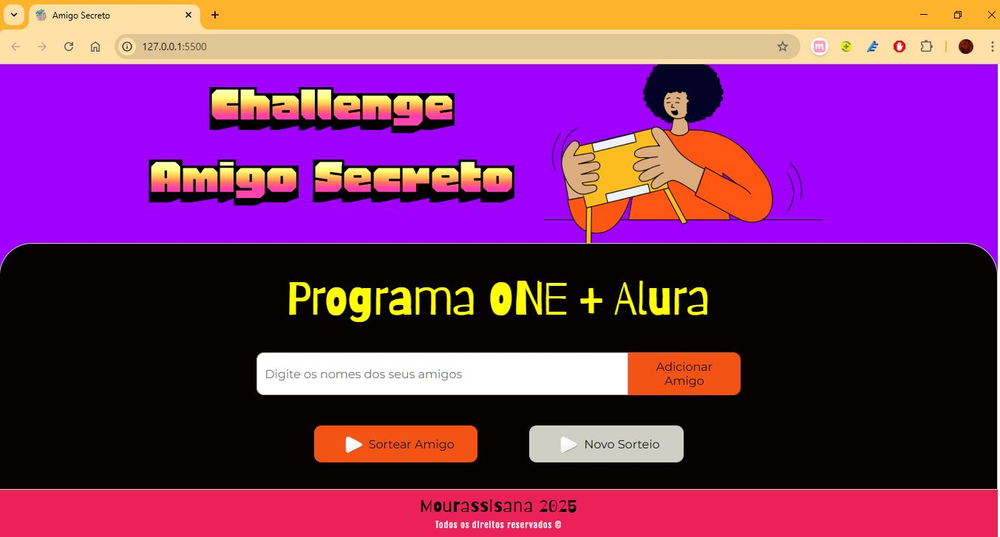

#Challenge Amigo Secreto

**Descrição**
Este é um projeto desenvolvido como parte do programa ONE (Oracle Next Education), em parceria com a Alura. 
O objetivo deste projeto é criar um sistema de Amigo Secreto interativo, utilizando JavaScript, HTML, CSS e a integração com o SweetAlert para proporcionar uma melhor experiência ao usuário.

**Funcionalidades**
- Cadastro de participantes
- Sorteio automático e randômico
- Exibição de mensagens personalizadas com o SweetAlert
- Validação dos dados inseridos
- Interface amigável e interativa

**Tecnologias Usadas**
* JavaScript (para lógica do sorteio)
* HTML (para estruturação da página)
* CSS (para estilização)
* SweetAlert (para interação com o usuário)

**Como Rodar o Projeto**
Clone este repositório para sua máquina:

git clone https://github.com/Mourassisana/DesafioAmigoSecretoAluraONE.git

Abra o projeto no seu editor de código preferido (recomendo o VS Code).
Abra o arquivo index.html no navegador para visualizar o projeto em funcionamento.

**Contribuições**
Se você deseja contribuir com o projeto, siga as instruções abaixo:

__Faça um fork deste repositório.__
Crie uma branch com suas alterações:

git checkout -b minha-alteracao

__Faça commit das suas alterações:__

git commit -m "Adiciona nova funcionalidade"

__Envie suas alterações para o repositório remoto:__

git push origin minha-alteracao

__Abra um Pull Request para revisão.__

**Licença**
Este projeto é de código aberto e está sob a licença MIT.